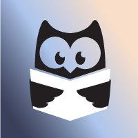

<!-- PROJECT LOGO -->
 

    
  <h3 align="center">Adopte un livre</h3>

  

    A small personal project like this
  

<!-- TABLE OF CONTENTS -->

  
Table of Contents

  <ol>
    <li>
      <a href="#about-the-project">About The Project</a>
      <ul>
        <li><a href="#built-with">Built With</a></li>
      </ul>
    </li>
    <li><a href="#roadmap">Roadmap</a></li>
    <li><a href="#contact">Contact</a></li>
  </ol>

<!-- ABOUT THE PROJECT -->
## About The Project

Adopte un livre aims to plagiarize the trend of dating sites. However, its goal is to find the perfect book for its reader. A crazy little idea that was born in my mind and that wants to be creative and innovative!

This application proposes in particular:
* The discovery of new books
* The swiping left and right that we love so much
* The possibility to add new books
* A reminder of the different buttons of the application

### Built With

* [Node.js](https://nodejs.org/)
* [Angular](https://angular.io/)

And many others

<!-- ROADMAP -->
## Roadmap

- [x] Book Swiping
- [x] Settings page
- [x] Page for adding books
    - [x] Database for adding books
    - [x] Small verification of the data entered
- [x] Login page
    - [ ] Database for login page
- [ ] Multi-language Support
    - [ ] English
    - [x] French

<!-- CONTACT -->
## Contact

Ludivine DUCAMP - ludivine.ducamp@orange.fr

Project Link: [https://github.com/Wallnya/Adopte-un-livre/](https://github.com/Wallnya/Adopte-un-livre/)
